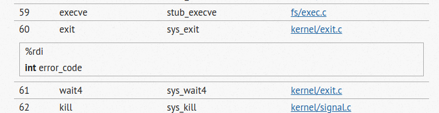
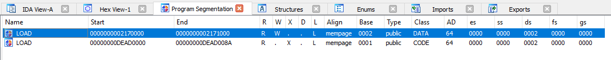

Tenet
=====

Category: misc, reverse

Description
-----------

```
You have to start looking at the world in a new way.

nc 52.192.42.215 9427

tenet-1050118538f6f01c2ad0049587dc0828e8a4f132e539e110f0cb04a8c17b78bf.tar.gz
```

When we unpack the attachment, we'll be given two files:

```
release/
release/server.rb
release/time_machine
```

In order to start solving the task, we needed to understand what the ``time_machine`` does. We spent quite some time in Ida and Ghidra to determine what is going on, but debugging this in GDB was a pain, due to the forking and ptrace capabilities of the executable. This is why we have rewritten the entire logic of the ``time_machine`` manually in C, which is provided below.

```
#include <cstdio>
#include <cstdlib>
#include <stdlib.h>
#include <sys/types.h>
#include <sys/stat.h>
#include <fcntl.h>
#include <unistd.h>
#include <sys/ptrace.h>
#include <sys/wait.h>
#include <sys/user.h>
#include <errno.h>

int PROCPID = 0;
int DAT_LOOPCOUNTER = 0; // DAT_00302044
long DAT_RIPS[0xfff] = {0}; // DAT_00302060
long long DAT_PEEKDATA = 0; //  DAT_0030a060

int perror(int pid, const char *arg)
{
  printf("Failed: %s\n", arg);
  kill(pid, 0);
  //wait(0);
  exit(1);
}

long getregs(int pid)
{
  struct user_regs_struct regs;
  int status = ptrace(PTRACE_GETREGS, pid, NULL, &regs);
  if(status != 0)
  {
    perror(pid, "ptrace");
  }
  return regs.rip;
}

void nop()
{
  return;
}

void setregs(int pid)
{
  int status = 0;
  long *regptrs = NULL;
  struct user_regs_struct regs = { 0 };
  struct user_fpregs_struct fpregs = { 0 };

  // set certain values
  regs.rip = 0xdead0080;
  regs.cs = 0x33;
  regs.ss = 0x2b;

  // set registers
  errno = 0;
  status = ptrace(PTRACE_SETREGS, PROCPID, 0, &regs);
  if(status != 0)
  {
    printf("ERROR SETREGS: 0x%X - PID: %d - errno: 0x%x\n", status, PROCPID, errno);
    perror(pid, "ptrace");
  }

  // set floating pointer registers
  errno = 0;
  status = ptrace(PTRACE_SETFPREGS, PROCPID, 0, &fpregs);
  if(status != 0)
  {
    printf("ERROR SETREGS: 0x%X - PID: %d - errno: 0x%x\n", status, PROCPID, errno);
    perror(pid, "ptrace");
  }
}

void zero_data(int pid)
{
  long long data;
  long long addr = 0x2170000;
  while(addr < 0x2171000)
  {
    data = ptrace(PTRACE_POKEDATA, pid, addr, 0);
    if(data != 0)
    {
      perror(pid, "ptrace");
    }
    addr += 0x8;
  }
}

long check_memory_zero(int pid)
{
  unsigned long data;
  unsigned long temp = 0;
  unsigned long addr = 0x2170000;

  // OR the entire contents of 0x1000 block
  while(addr < 0x2171000)
  {
    data = ptrace(PTRACE_PEEKDATA, pid, addr, 0);
    temp = temp | data;
    addr += 0x8;
  }

  return data & 0xffffffffffffff00 | (temp == 0);
}

void randomize(int pid)
{
  int fd = open("/dev/urandom", 0);
  if(fd < 0)
  {
    perror(pid, "urandom");
  }

  ssize_t res = read(fd, &DAT_PEEKDATA, 8);
  if(res != 8)
  {
    perror(pid, "read urandom");
  }

  // copy DAT_PEEKDATA to the specified address
  long data = ptrace(PTRACE_POKEDATA, pid, 0x2170000, DAT_PEEKDATA);
  if(data != 0)
  {
    perror(pid, "ptrace");
  }
  return;
}

long get_rax_rcx(long *temp)
{
  struct user_regs_struct regs;
  long status;
  status  = ptrace(PTRACE_GETREGS, PROCPID, NULL, &regs);
  if(status != 0)
  {
    perror(PROCPID, "ptrace");
  }

  status = ptrace(PTRACE_PEEKDATA, PROCPID, regs.rip, 0);
  if(((status & 0xffff) == 0x050f) || ((status & 0xffff) == 0x340f))
  {
     *temp = regs.rax;
     return 1;
  }

  return 0;
}

long check_ss()
{
  struct user_regs_struct regs;
  long status;
  status  = ptrace(PTRACE_GETREGS, PROCPID, NULL, &regs);
  if(status != 0)
  {
    perror(PROCPID, "ptrace");
  }
  if((regs.cs == 0x33) && (regs.ss== 0x2b))
  {
    return 0;
  }

  return 1;
}

void update_rip(long temp)
{
  struct user_regs_struct regs;
  long status;
  status  = ptrace(PTRACE_GETREGS, PROCPID, NULL, &regs);
  if(status != 0)
  {
    perror(PROCPID, "ptrace");
  }

  regs.rip += temp;

  // set registers
  status = ptrace(PTRACE_SETREGS, PROCPID, 0, &regs);
  if(status != 0)
  {
    perror(PROCPID, "ptrace");
  }

  return;
}

char crazy_stuff()
{
  long temp;
  long y;

  do {
    // Released only when we do a sysenter
    char c1 = get_rax_rcx(&temp);
    if(c1 == '\0')
    {
      char c2 = check_ss(); // Must always be 0
      if(c2 != '\0')
      {
        perror(PROCPID, "invalid data");
      }
      return 0;
    }

    if(temp == 0x3c)
    {
      return 1;
    }

    update_rip(2);
  } while(true);

  return '\0';
}

char peek_data()
{
  long data = ptrace(PTRACE_PEEKDATA, PROCPID, 0x2170000,0);
  return DAT_PEEKDATA & 0xffffffffffffff00 | (data == DAT_PEEKDATA);
}

void exec_in_reverse()
{
  struct user_regs_struct regs;
  int temp;
  unsigned int temp2;
  pid_t pid;

  setregs(PROCPID);
  int loopcounter = DAT_LOOPCOUNTER;
  while(true)
  {
    loopcounter--;
    if(loopcounter < 0)
    {
      return;
    }

    int data = ptrace(PTRACE_GETREGS, PROCPID, NULL, &regs);
    if(data != 0)
    {
      perror(pid, "ptrace");
    }

    regs.rip = DAT_RIPS[loopcounter];
    long status = ptrace(PTRACE_SETREGS, PROCPID, NULL, &regs);
    if(status != 0)
    {
      perror(pid, "ptrace");
    }

    printf("RIP BACKWARD: 0x%X\n", regs.rip);
    long retval = ptrace(PTRACE_SINGLESTEP, PROCPID, 0, 0);
    if(retval != 0)
    {
      perror(pid, "ptrace");
    }

    temp = 0;
    pid = wait(&temp);
    if((temp & 0x7f) == 0)
    {
      break;
    }

    temp2 = (int)temp >> 8 & 0xff;
    if(temp2 != 5)
    {
      perror(PROCPID, "child dead");
    }
  }

  puts("exit too early...");
  _exit(1);
}

int Debugger(char *program)
{
  puts("Debugger");

  // Start the process and debug it
  PROCPID = fork();

  // CHILD
  if (PROCPID == 0)
  {
    ptrace(PTRACE_TRACEME, 0, 0, 0);
    execve(program, 0, 0);
    perror(PROCPID, "execve");
  }

  // PARENT
  printf("Child PID: %i\n", PROCPID);
  long s = ptrace(PTRACE_ATTACH, PROCPID, 0, 0);
  if(s != 0)
  {
    perror(PROCPID, "ptrace");
  }

  int status = 0;
  int pid = waitpid(PROCPID, &status, 2);
  printf("Obtained PID: %d - status: 0x%X\n", pid, status);
  if((pid != PROCPID) || (status & 0xff) != 0x7f)
  {
    perror(pid, "the first wait");
  }

  bool finished = false;
  bool process_success = false;
  long retval = 0;
  int iteration = 0;

  while(true)
  {
    do {
      retval = ptrace(PTRACE_SINGLESTEP, PROCPID, 0, 0);
      if(retval != 0)
      {
        perror(pid, "single step");
      }
      wait(&status);

      // check child status
      if((status & 0x7f) == 0) { goto endprocessing; }
      if((status >> 8 & 0xffU) != 5)
      {
        perror(pid, "child dead unexpectedly.");
      }

      // check loop counter
      if(0xfff < DAT_LOOPCOUNTER)
      {
        perror(pid, "too many steps.");
      }

      // wait until reaching our shellcode and only then start processing
      if(!finished)
      {
        long rip = getregs(pid);
        if(rip == 0xdead0080)
        {
          printf("INSIDE\n");
          finished = true;
          nop();

          // go to the beginning of our shellcode (we're already here)
          setregs(pid);

          // read 0x1000 of memory which must succeed
          zero_data(pid);

          // set first 8-bytes of data with RANDOM
          randomize(pid);
        }
      }
      iteration++;
    } while (!finished);

    char x = crazy_stuff();
    if(x != '\0')
    {
      break;
    }


    // Store current RIP addresses into array
    long rip2 = getregs(pid);
    printf("RIP FORWARD: 0x%X\n", rip2);
    DAT_RIPS[DAT_LOOPCOUNTER]  = rip2;
    DAT_LOOPCOUNTER++;
  }
  process_success = true;

endprocessing:
  if(!process_success)
  {
    perror(pid, "error");
  }

  // TO GET HERE: mov eax, 0x3c; syscall
  printf("FINISH LOOP\n");

  char data2 = check_memory_zero(pid);
  if(data2 != '\x01')
  {
    perror(pid, "please swallow the cookie");
  }
  printf("FINISH SWALLOWING COOKIE\n");

  exec_in_reverse();
  printf("FINISH EXECUTING INSTRUCTIONS IN REVERSE\n");

  char data3 = peek_data();
  if(data3 != '\x01')
  {
    perror(pid, "you should vomit the cookie out");
  }

  printf("hitcon{FLAG}");

  return 0;
}

int main(int argc, char **argv)
{
  if(argc != 2)
  {
    printf("Usage: %s <program>\n", argv[0]);
    exit(1);
  }
  return Debugger(argv[1]);
}
```

We can then compile the code as follows:

```
g++ debugger.cc -Wall -Wextra -Wno-format -Wno-unused-variable -o debugger
```
Then we only need to come up with the shellcode to feed to the newly written debugger binary (replicated the ``time_machine``), but we have the code, so we can perform all kinds of things, like insert additional code for debugging purposes.

At the end of the day, we basically need to perform three things:

1. A random 8-byte value is generated by the debugger and then copied into the debuggee at 0x2170000 address.
2. The instructions are executed forwards one by one until reaching the `exit <https://filippo.io/linux-syscall-table/`__ syscall. All the instruction pointer addresses are stored into global array, but at most 0xfff instructions is allowed.

  

3. At this point our shellcode has been run and the debugger checks if the entire memory contents 0x2170000 - 0x2171000 is zero, meaning the randomly generated value must not be there - our shellcode must have zeroed out this value. We need to store this value somewhere else, we'll see later on where.
4. The entire general purpose registers as well as floating point registers are zeroed-out, so we can't save the random value in there.
5. All the instructions from our shellcode are executed backwards.
6. A check is made if the original random value is at 0x2170000 address.

At this point we've been pretty close to the solution, all we needed to figure out is where to store the randomly generated value. We can't save them anywhere else in memory, because only the segment 0x2170000 - 0x2171000 is writeable and the debugger will check that the entire contents is zero.



Also, we can't save them into any general purpose or floating point register, because those are all zeroed out by the debugger. So where can we actually save the random value that we need to preserve. The following registers are all zeroed out:

```
struct user_fpregs_struct
{
  __uint16_t                cwd;
  __uint16_t                swd;
  __uint16_t                ftw;
  __uint16_t                fop;
  __uint64_t                rip;
  __uint64_t                rdp;
  __uint32_t                mxcsr;
  __uint32_t                mxcr_mask;
  __uint32_t                st_space[32];   /* 8*16 bytes for each FP-reg = 128 bytes */
  __uint32_t                xmm_space[64];  /* 16*16 bytes for each XMM-reg = 256 bytes */
  __uint32_t                padding[24];
};

struct user_regs_struct
{
  unsigned long r15;
  unsigned long r14;
  unsigned long r13;
  unsigned long r12;
  unsigned long rbp;
  unsigned long rbx;
  unsigned long r11;
  unsigned long r10;
  unsigned long r9;
  unsigned long r8;
  unsigned long rax;
  unsigned long rcx;
  unsigned long rdx;
  unsigned long rsi;
  unsigned long rdi;
  unsigned long orig_rax;
  unsigned long rip;
  unsigned long cs;
  unsigned long eflags;
  unsigned long rsp;
  unsigned long ss;
  unsigned long fs_base;
  unsigned long gs_base;
  unsigned long ds;
  unsigned long es;
  unsigned long fs;
  unsigned long gs;
};
```

We can rely on the fact that there are 64-bit XMM0 - XMM15 floating point registers and their counterpart 256-bit YMM0 - YMM15 floating point registers. We can see that the higher 64-bits of the YMM0 - YMM15 registers are not cleared, so we can store the cookie in there. We can basically use the following shellcode:

```
[BITS 64]

global _start

_start:
  ; store cookie to MMX
  mov rax, 0x2170000
  movq xmm0, [rax]
  ; ymm0[127:0] -> ymm0[255:128]
  vperm2f128 ymm0, ymm0, ymm0, 0

  ; set the cookie to 0
  xor rbx, rbx

  ; swallow the cookie
  mov rax, 0x2170000
  mov [rax], rbx
  mov rax, 0x2170000

  ; get the cookie
  movq rbx, xmm0

  ; ymm0[255:128] -> ymm0[127:0]
  vperm2f128 ymm0, ymm0, ymm0, 1

  ; break out of loop
  mov rdi, 0x1
  mov rax, 0x3c
  sysenter
```

We can compile it with netwide assembler, but since we only want the actual shellcode we can use the ``-f bin`` option to get only the flat-form binary.

```
# nasm -f bin shell.asm && xxd -p shell
b800001702f30f7e00c4e37d06c0004831dbb800001702488918b8000017
0266480f7ec3c4e37d06c001bf01000000b83c0000000f34
```

Let's now create our own ELF binary file, the one that was outputted by ruby script and modify just the shellcode part. The part from 00001080 onwards is our shellcode above.

```
00000000  7F 45 4C 46 02 01 01 00 00 00 00 00 00 00 00 00  .ELF............
00000010  02 00 3E 00 00 00 00 00 00 00 AD DE 00 00 00 00  ..>........Þ....
00000020  40 00 00 00 00 00 00 00 00 00 00 00 00 00 00 00  @...............
00000030  00 00 00 00 40 00 38 00 03 00 00 00 00 00 00 00  ....@.8.........
00000040  01 00 00 00 05 00 00 00 00 10 00 00 00 00 00 00  ................
00000050  00 00 AD DE 00 00 00 00 00 00 AD DE 00 00 00 00  ...Þ.......Þ....
00000060  8A 00 00 00 00 00 00 00 8A 00 00 00 00 00 00 00  Š.......Š.......
00000070  00 10 00 00 00 00 00 00 01 00 00 00 06 00 00 00  ................
00000080  00 00 00 00 00 00 00 00 00 00 17 02 00 00 00 00  ................
00000090  00 00 17 02 00 00 00 00 01 00 00 00 00 00 00 00  ................
000000A0  00 10 00 00 00 00 00 00 00 10 00 00 00 00 00 00  ................
000000B0  51 E5 74 64 06 00 00 00 00 00 00 00 00 00 00 00  Qåtd............
000000C0  00 00 00 00 00 00 00 00 00 00 00 00 00 00 00 00  ................
000000D0  00 00 00 00 00 00 00 00 00 00 00 00 00 00 00 00  ................
000000E0  10 00 00 00 00 00 00 00 00 00 00 00 00 00 00 00  ................
000000F0  00 00 00 00 00 00 00 00 00 00 00 00 00 00 00 00  ................
00000100  00 00 00 00 00 00 00 00 00 00 00 00 00 00 00 00  ................
00000110  00 00 00 00 00 00 00 00 00 00 00 00 00 00 00 00  ................
00000120  00 00 00 00 00 00 00 00 00 00 00 00 00 00 00 00  ................
00000130  00 00 00 00 00 00 00 00 00 00 00 00 00 00 00 00  ................
00000140  00 00 00 00 00 00 00 00 00 00 00 00 00 00 00 00  ................
00000150  00 00 00 00 00 00 00 00 00 00 00 00 00 00 00 00  ................
00000160  00 00 00 00 00 00 00 00 00 00 00 00 00 00 00 00  ................
00000170  00 00 00 00 00 00 00 00 00 00 00 00 00 00 00 00  ................
00000180  00 00 00 00 00 00 00 00 00 00 00 00 00 00 00 00  ................
00000190  00 00 00 00 00 00 00 00 00 00 00 00 00 00 00 00  ................
000001A0  00 00 00 00 00 00 00 00 00 00 00 00 00 00 00 00  ................
000001B0  00 00 00 00 00 00 00 00 00 00 00 00 00 00 00 00  ................
000001C0  00 00 00 00 00 00 00 00 00 00 00 00 00 00 00 00  ................
000001D0  00 00 00 00 00 00 00 00 00 00 00 00 00 00 00 00  ................
000001E0  00 00 00 00 00 00 00 00 00 00 00 00 00 00 00 00  ................
000001F0  00 00 00 00 00 00 00 00 00 00 00 00 00 00 00 00  ................
00000200  00 00 00 00 00 00 00 00 00 00 00 00 00 00 00 00  ................
00000210  00 00 00 00 00 00 00 00 00 00 00 00 00 00 00 00  ................
00000220  00 00 00 00 00 00 00 00 00 00 00 00 00 00 00 00  ................
00000230  00 00 00 00 00 00 00 00 00 00 00 00 00 00 00 00  ................
00000240  00 00 00 00 00 00 00 00 00 00 00 00 00 00 00 00  ................
00000250  00 00 00 00 00 00 00 00 00 00 00 00 00 00 00 00  ................
00000260  00 00 00 00 00 00 00 00 00 00 00 00 00 00 00 00  ................
00000270  00 00 00 00 00 00 00 00 00 00 00 00 00 00 00 00  ................
00000280  00 00 00 00 00 00 00 00 00 00 00 00 00 00 00 00  ................
00000290  00 00 00 00 00 00 00 00 00 00 00 00 00 00 00 00  ................
000002A0  00 00 00 00 00 00 00 00 00 00 00 00 00 00 00 00  ................
000002B0  00 00 00 00 00 00 00 00 00 00 00 00 00 00 00 00  ................
000002C0  00 00 00 00 00 00 00 00 00 00 00 00 00 00 00 00  ................
000002D0  00 00 00 00 00 00 00 00 00 00 00 00 00 00 00 00  ................
000002E0  00 00 00 00 00 00 00 00 00 00 00 00 00 00 00 00  ................
000002F0  00 00 00 00 00 00 00 00 00 00 00 00 00 00 00 00  ................
00000300  00 00 00 00 00 00 00 00 00 00 00 00 00 00 00 00  ................
00000310  00 00 00 00 00 00 00 00 00 00 00 00 00 00 00 00  ................
00000320  00 00 00 00 00 00 00 00 00 00 00 00 00 00 00 00  ................
00000330  00 00 00 00 00 00 00 00 00 00 00 00 00 00 00 00  ................
00000340  00 00 00 00 00 00 00 00 00 00 00 00 00 00 00 00  ................
00000350  00 00 00 00 00 00 00 00 00 00 00 00 00 00 00 00  ................
00000360  00 00 00 00 00 00 00 00 00 00 00 00 00 00 00 00  ................
00000370  00 00 00 00 00 00 00 00 00 00 00 00 00 00 00 00  ................
00000380  00 00 00 00 00 00 00 00 00 00 00 00 00 00 00 00  ................
00000390  00 00 00 00 00 00 00 00 00 00 00 00 00 00 00 00  ................
000003A0  00 00 00 00 00 00 00 00 00 00 00 00 00 00 00 00  ................
000003B0  00 00 00 00 00 00 00 00 00 00 00 00 00 00 00 00  ................
000003C0  00 00 00 00 00 00 00 00 00 00 00 00 00 00 00 00  ................
000003D0  00 00 00 00 00 00 00 00 00 00 00 00 00 00 00 00  ................
000003E0  00 00 00 00 00 00 00 00 00 00 00 00 00 00 00 00  ................
000003F0  00 00 00 00 00 00 00 00 00 00 00 00 00 00 00 00  ................
00000400  00 00 00 00 00 00 00 00 00 00 00 00 00 00 00 00  ................
00000410  00 00 00 00 00 00 00 00 00 00 00 00 00 00 00 00  ................
00000420  00 00 00 00 00 00 00 00 00 00 00 00 00 00 00 00  ................
00000430  00 00 00 00 00 00 00 00 00 00 00 00 00 00 00 00  ................
00000440  00 00 00 00 00 00 00 00 00 00 00 00 00 00 00 00  ................
00000450  00 00 00 00 00 00 00 00 00 00 00 00 00 00 00 00  ................
00000460  00 00 00 00 00 00 00 00 00 00 00 00 00 00 00 00  ................
00000470  00 00 00 00 00 00 00 00 00 00 00 00 00 00 00 00  ................
00000480  00 00 00 00 00 00 00 00 00 00 00 00 00 00 00 00  ................
00000490  00 00 00 00 00 00 00 00 00 00 00 00 00 00 00 00  ................
000004A0  00 00 00 00 00 00 00 00 00 00 00 00 00 00 00 00  ................
000004B0  00 00 00 00 00 00 00 00 00 00 00 00 00 00 00 00  ................
000004C0  00 00 00 00 00 00 00 00 00 00 00 00 00 00 00 00  ................
000004D0  00 00 00 00 00 00 00 00 00 00 00 00 00 00 00 00  ................
000004E0  00 00 00 00 00 00 00 00 00 00 00 00 00 00 00 00  ................
000004F0  00 00 00 00 00 00 00 00 00 00 00 00 00 00 00 00  ................
00000500  00 00 00 00 00 00 00 00 00 00 00 00 00 00 00 00  ................
00000510  00 00 00 00 00 00 00 00 00 00 00 00 00 00 00 00  ................
00000520  00 00 00 00 00 00 00 00 00 00 00 00 00 00 00 00  ................
00000530  00 00 00 00 00 00 00 00 00 00 00 00 00 00 00 00  ................
00000540  00 00 00 00 00 00 00 00 00 00 00 00 00 00 00 00  ................
00000550  00 00 00 00 00 00 00 00 00 00 00 00 00 00 00 00  ................
00000560  00 00 00 00 00 00 00 00 00 00 00 00 00 00 00 00  ................
00000570  00 00 00 00 00 00 00 00 00 00 00 00 00 00 00 00  ................
00000580  00 00 00 00 00 00 00 00 00 00 00 00 00 00 00 00  ................
00000590  00 00 00 00 00 00 00 00 00 00 00 00 00 00 00 00  ................
000005A0  00 00 00 00 00 00 00 00 00 00 00 00 00 00 00 00  ................
000005B0  00 00 00 00 00 00 00 00 00 00 00 00 00 00 00 00  ................
000005C0  00 00 00 00 00 00 00 00 00 00 00 00 00 00 00 00  ................
000005D0  00 00 00 00 00 00 00 00 00 00 00 00 00 00 00 00  ................
000005E0  00 00 00 00 00 00 00 00 00 00 00 00 00 00 00 00  ................
000005F0  00 00 00 00 00 00 00 00 00 00 00 00 00 00 00 00  ................
00000600  00 00 00 00 00 00 00 00 00 00 00 00 00 00 00 00  ................
00000610  00 00 00 00 00 00 00 00 00 00 00 00 00 00 00 00  ................
00000620  00 00 00 00 00 00 00 00 00 00 00 00 00 00 00 00  ................
00000630  00 00 00 00 00 00 00 00 00 00 00 00 00 00 00 00  ................
00000640  00 00 00 00 00 00 00 00 00 00 00 00 00 00 00 00  ................
00000650  00 00 00 00 00 00 00 00 00 00 00 00 00 00 00 00  ................
00000660  00 00 00 00 00 00 00 00 00 00 00 00 00 00 00 00  ................
00000670  00 00 00 00 00 00 00 00 00 00 00 00 00 00 00 00  ................
00000680  00 00 00 00 00 00 00 00 00 00 00 00 00 00 00 00  ................
00000690  00 00 00 00 00 00 00 00 00 00 00 00 00 00 00 00  ................
000006A0  00 00 00 00 00 00 00 00 00 00 00 00 00 00 00 00  ................
000006B0  00 00 00 00 00 00 00 00 00 00 00 00 00 00 00 00  ................
000006C0  00 00 00 00 00 00 00 00 00 00 00 00 00 00 00 00  ................
000006D0  00 00 00 00 00 00 00 00 00 00 00 00 00 00 00 00  ................
000006E0  00 00 00 00 00 00 00 00 00 00 00 00 00 00 00 00  ................
000006F0  00 00 00 00 00 00 00 00 00 00 00 00 00 00 00 00  ................
00000700  00 00 00 00 00 00 00 00 00 00 00 00 00 00 00 00  ................
00000710  00 00 00 00 00 00 00 00 00 00 00 00 00 00 00 00  ................
00000720  00 00 00 00 00 00 00 00 00 00 00 00 00 00 00 00  ................
00000730  00 00 00 00 00 00 00 00 00 00 00 00 00 00 00 00  ................
00000740  00 00 00 00 00 00 00 00 00 00 00 00 00 00 00 00  ................
00000750  00 00 00 00 00 00 00 00 00 00 00 00 00 00 00 00  ................
00000760  00 00 00 00 00 00 00 00 00 00 00 00 00 00 00 00  ................
00000770  00 00 00 00 00 00 00 00 00 00 00 00 00 00 00 00  ................
00000780  00 00 00 00 00 00 00 00 00 00 00 00 00 00 00 00  ................
00000790  00 00 00 00 00 00 00 00 00 00 00 00 00 00 00 00  ................
000007A0  00 00 00 00 00 00 00 00 00 00 00 00 00 00 00 00  ................
000007B0  00 00 00 00 00 00 00 00 00 00 00 00 00 00 00 00  ................
000007C0  00 00 00 00 00 00 00 00 00 00 00 00 00 00 00 00  ................
000007D0  00 00 00 00 00 00 00 00 00 00 00 00 00 00 00 00  ................
000007E0  00 00 00 00 00 00 00 00 00 00 00 00 00 00 00 00  ................
000007F0  00 00 00 00 00 00 00 00 00 00 00 00 00 00 00 00  ................
00000800  00 00 00 00 00 00 00 00 00 00 00 00 00 00 00 00  ................
00000810  00 00 00 00 00 00 00 00 00 00 00 00 00 00 00 00  ................
00000820  00 00 00 00 00 00 00 00 00 00 00 00 00 00 00 00  ................
00000830  00 00 00 00 00 00 00 00 00 00 00 00 00 00 00 00  ................
00000840  00 00 00 00 00 00 00 00 00 00 00 00 00 00 00 00  ................
00000850  00 00 00 00 00 00 00 00 00 00 00 00 00 00 00 00  ................
00000860  00 00 00 00 00 00 00 00 00 00 00 00 00 00 00 00  ................
00000870  00 00 00 00 00 00 00 00 00 00 00 00 00 00 00 00  ................
00000880  00 00 00 00 00 00 00 00 00 00 00 00 00 00 00 00  ................
00000890  00 00 00 00 00 00 00 00 00 00 00 00 00 00 00 00  ................
000008A0  00 00 00 00 00 00 00 00 00 00 00 00 00 00 00 00  ................
000008B0  00 00 00 00 00 00 00 00 00 00 00 00 00 00 00 00  ................
000008C0  00 00 00 00 00 00 00 00 00 00 00 00 00 00 00 00  ................
000008D0  00 00 00 00 00 00 00 00 00 00 00 00 00 00 00 00  ................
000008E0  00 00 00 00 00 00 00 00 00 00 00 00 00 00 00 00  ................
000008F0  00 00 00 00 00 00 00 00 00 00 00 00 00 00 00 00  ................
00000900  00 00 00 00 00 00 00 00 00 00 00 00 00 00 00 00  ................
00000910  00 00 00 00 00 00 00 00 00 00 00 00 00 00 00 00  ................
00000920  00 00 00 00 00 00 00 00 00 00 00 00 00 00 00 00  ................
00000930  00 00 00 00 00 00 00 00 00 00 00 00 00 00 00 00  ................
00000940  00 00 00 00 00 00 00 00 00 00 00 00 00 00 00 00  ................
00000950  00 00 00 00 00 00 00 00 00 00 00 00 00 00 00 00  ................
00000960  00 00 00 00 00 00 00 00 00 00 00 00 00 00 00 00  ................
00000970  00 00 00 00 00 00 00 00 00 00 00 00 00 00 00 00  ................
00000980  00 00 00 00 00 00 00 00 00 00 00 00 00 00 00 00  ................
00000990  00 00 00 00 00 00 00 00 00 00 00 00 00 00 00 00  ................
000009A0  00 00 00 00 00 00 00 00 00 00 00 00 00 00 00 00  ................
000009B0  00 00 00 00 00 00 00 00 00 00 00 00 00 00 00 00  ................
000009C0  00 00 00 00 00 00 00 00 00 00 00 00 00 00 00 00  ................
000009D0  00 00 00 00 00 00 00 00 00 00 00 00 00 00 00 00  ................
000009E0  00 00 00 00 00 00 00 00 00 00 00 00 00 00 00 00  ................
000009F0  00 00 00 00 00 00 00 00 00 00 00 00 00 00 00 00  ................
00000A00  00 00 00 00 00 00 00 00 00 00 00 00 00 00 00 00  ................
00000A10  00 00 00 00 00 00 00 00 00 00 00 00 00 00 00 00  ................
00000A20  00 00 00 00 00 00 00 00 00 00 00 00 00 00 00 00  ................
00000A30  00 00 00 00 00 00 00 00 00 00 00 00 00 00 00 00  ................
00000A40  00 00 00 00 00 00 00 00 00 00 00 00 00 00 00 00  ................
00000A50  00 00 00 00 00 00 00 00 00 00 00 00 00 00 00 00  ................
00000A60  00 00 00 00 00 00 00 00 00 00 00 00 00 00 00 00  ................
00000A70  00 00 00 00 00 00 00 00 00 00 00 00 00 00 00 00  ................
00000A80  00 00 00 00 00 00 00 00 00 00 00 00 00 00 00 00  ................
00000A90  00 00 00 00 00 00 00 00 00 00 00 00 00 00 00 00  ................
00000AA0  00 00 00 00 00 00 00 00 00 00 00 00 00 00 00 00  ................
00000AB0  00 00 00 00 00 00 00 00 00 00 00 00 00 00 00 00  ................
00000AC0  00 00 00 00 00 00 00 00 00 00 00 00 00 00 00 00  ................
00000AD0  00 00 00 00 00 00 00 00 00 00 00 00 00 00 00 00  ................
00000AE0  00 00 00 00 00 00 00 00 00 00 00 00 00 00 00 00  ................
00000AF0  00 00 00 00 00 00 00 00 00 00 00 00 00 00 00 00  ................
00000B00  00 00 00 00 00 00 00 00 00 00 00 00 00 00 00 00  ................
00000B10  00 00 00 00 00 00 00 00 00 00 00 00 00 00 00 00  ................
00000B20  00 00 00 00 00 00 00 00 00 00 00 00 00 00 00 00  ................
00000B30  00 00 00 00 00 00 00 00 00 00 00 00 00 00 00 00  ................
00000B40  00 00 00 00 00 00 00 00 00 00 00 00 00 00 00 00  ................
00000B50  00 00 00 00 00 00 00 00 00 00 00 00 00 00 00 00  ................
00000B60  00 00 00 00 00 00 00 00 00 00 00 00 00 00 00 00  ................
00000B70  00 00 00 00 00 00 00 00 00 00 00 00 00 00 00 00  ................
00000B80  00 00 00 00 00 00 00 00 00 00 00 00 00 00 00 00  ................
00000B90  00 00 00 00 00 00 00 00 00 00 00 00 00 00 00 00  ................
00000BA0  00 00 00 00 00 00 00 00 00 00 00 00 00 00 00 00  ................
00000BB0  00 00 00 00 00 00 00 00 00 00 00 00 00 00 00 00  ................
00000BC0  00 00 00 00 00 00 00 00 00 00 00 00 00 00 00 00  ................
00000BD0  00 00 00 00 00 00 00 00 00 00 00 00 00 00 00 00  ................
00000BE0  00 00 00 00 00 00 00 00 00 00 00 00 00 00 00 00  ................
00000BF0  00 00 00 00 00 00 00 00 00 00 00 00 00 00 00 00  ................
00000C00  00 00 00 00 00 00 00 00 00 00 00 00 00 00 00 00  ................
00000C10  00 00 00 00 00 00 00 00 00 00 00 00 00 00 00 00  ................
00000C20  00 00 00 00 00 00 00 00 00 00 00 00 00 00 00 00  ................
00000C30  00 00 00 00 00 00 00 00 00 00 00 00 00 00 00 00  ................
00000C40  00 00 00 00 00 00 00 00 00 00 00 00 00 00 00 00  ................
00000C50  00 00 00 00 00 00 00 00 00 00 00 00 00 00 00 00  ................
00000C60  00 00 00 00 00 00 00 00 00 00 00 00 00 00 00 00  ................
00000C70  00 00 00 00 00 00 00 00 00 00 00 00 00 00 00 00  ................
00000C80  00 00 00 00 00 00 00 00 00 00 00 00 00 00 00 00  ................
00000C90  00 00 00 00 00 00 00 00 00 00 00 00 00 00 00 00  ................
00000CA0  00 00 00 00 00 00 00 00 00 00 00 00 00 00 00 00  ................
00000CB0  00 00 00 00 00 00 00 00 00 00 00 00 00 00 00 00  ................
00000CC0  00 00 00 00 00 00 00 00 00 00 00 00 00 00 00 00  ................
00000CD0  00 00 00 00 00 00 00 00 00 00 00 00 00 00 00 00  ................
00000CE0  00 00 00 00 00 00 00 00 00 00 00 00 00 00 00 00  ................
00000CF0  00 00 00 00 00 00 00 00 00 00 00 00 00 00 00 00  ................
00000D00  00 00 00 00 00 00 00 00 00 00 00 00 00 00 00 00  ................
00000D10  00 00 00 00 00 00 00 00 00 00 00 00 00 00 00 00  ................
00000D20  00 00 00 00 00 00 00 00 00 00 00 00 00 00 00 00  ................
00000D30  00 00 00 00 00 00 00 00 00 00 00 00 00 00 00 00  ................
00000D40  00 00 00 00 00 00 00 00 00 00 00 00 00 00 00 00  ................
00000D50  00 00 00 00 00 00 00 00 00 00 00 00 00 00 00 00  ................
00000D60  00 00 00 00 00 00 00 00 00 00 00 00 00 00 00 00  ................
00000D70  00 00 00 00 00 00 00 00 00 00 00 00 00 00 00 00  ................
00000D80  00 00 00 00 00 00 00 00 00 00 00 00 00 00 00 00  ................
00000D90  00 00 00 00 00 00 00 00 00 00 00 00 00 00 00 00  ................
00000DA0  00 00 00 00 00 00 00 00 00 00 00 00 00 00 00 00  ................
00000DB0  00 00 00 00 00 00 00 00 00 00 00 00 00 00 00 00  ................
00000DC0  00 00 00 00 00 00 00 00 00 00 00 00 00 00 00 00  ................
00000DD0  00 00 00 00 00 00 00 00 00 00 00 00 00 00 00 00  ................
00000DE0  00 00 00 00 00 00 00 00 00 00 00 00 00 00 00 00  ................
00000DF0  00 00 00 00 00 00 00 00 00 00 00 00 00 00 00 00  ................
00000E00  00 00 00 00 00 00 00 00 00 00 00 00 00 00 00 00  ................
00000E10  00 00 00 00 00 00 00 00 00 00 00 00 00 00 00 00  ................
00000E20  00 00 00 00 00 00 00 00 00 00 00 00 00 00 00 00  ................
00000E30  00 00 00 00 00 00 00 00 00 00 00 00 00 00 00 00  ................
00000E40  00 00 00 00 00 00 00 00 00 00 00 00 00 00 00 00  ................
00000E50  00 00 00 00 00 00 00 00 00 00 00 00 00 00 00 00  ................
00000E60  00 00 00 00 00 00 00 00 00 00 00 00 00 00 00 00  ................
00000E70  00 00 00 00 00 00 00 00 00 00 00 00 00 00 00 00  ................
00000E80  00 00 00 00 00 00 00 00 00 00 00 00 00 00 00 00  ................
00000E90  00 00 00 00 00 00 00 00 00 00 00 00 00 00 00 00  ................
00000EA0  00 00 00 00 00 00 00 00 00 00 00 00 00 00 00 00  ................
00000EB0  00 00 00 00 00 00 00 00 00 00 00 00 00 00 00 00  ................
00000EC0  00 00 00 00 00 00 00 00 00 00 00 00 00 00 00 00  ................
00000ED0  00 00 00 00 00 00 00 00 00 00 00 00 00 00 00 00  ................
00000EE0  00 00 00 00 00 00 00 00 00 00 00 00 00 00 00 00  ................
00000EF0  00 00 00 00 00 00 00 00 00 00 00 00 00 00 00 00  ................
00000F00  00 00 00 00 00 00 00 00 00 00 00 00 00 00 00 00  ................
00000F10  00 00 00 00 00 00 00 00 00 00 00 00 00 00 00 00  ................
00000F20  00 00 00 00 00 00 00 00 00 00 00 00 00 00 00 00  ................
00000F30  00 00 00 00 00 00 00 00 00 00 00 00 00 00 00 00  ................
00000F40  00 00 00 00 00 00 00 00 00 00 00 00 00 00 00 00  ................
00000F50  00 00 00 00 00 00 00 00 00 00 00 00 00 00 00 00  ................
00000F60  00 00 00 00 00 00 00 00 00 00 00 00 00 00 00 00  ................
00000F70  00 00 00 00 00 00 00 00 00 00 00 00 00 00 00 00  ................
00000F80  00 00 00 00 00 00 00 00 00 00 00 00 00 00 00 00  ................
00000F90  00 00 00 00 00 00 00 00 00 00 00 00 00 00 00 00  ................
00000FA0  00 00 00 00 00 00 00 00 00 00 00 00 00 00 00 00  ................
00000FB0  00 00 00 00 00 00 00 00 00 00 00 00 00 00 00 00  ................
00000FC0  00 00 00 00 00 00 00 00 00 00 00 00 00 00 00 00  ................
00000FD0  00 00 00 00 00 00 00 00 00 00 00 00 00 00 00 00  ................
00000FE0  00 00 00 00 00 00 00 00 00 00 00 00 00 00 00 00  ................
00000FF0  00 00 00 00 00 00 00 00 00 00 00 00 00 00 00 00  ................
00001000  EB 5A 6A 26 5F 6A 01 5E 31 C0 B0 9D 0F 05 6A 16  ëZj&_j.^1À°...j.
00001010  5F 48 8D 15 14 00 00 00 52 6A 06 48 89 E2 6A 02  _H......Rj.H‰âj.
00001020  5E 31 C0 B0 9D 0F 05 48 83 C4 10 C3 20 00 00 00  ^1À°...HƒÄ.à ...
00001030  04 00 00 00 15 00 00 02 3E 00 00 C0 20 00 00 00  ........>..À ...
00001040  00 00 00 00 15 00 01 00 0B 00 00 00 06 00 00 00  ................
00001050  00 00 00 00 06 00 00 00 00 00 FF 7F E8 A1 FF FF  ..........ÿ.è¡ÿÿ
00001060  FF 48 89 E7 48 81 E7 00 F0 FF FF 48 81 EF 00 10  ÿH‰çH.ç.ðÿÿH.ï..
00001070  02 00 48 C7 C6 00 40 02 00 48 31 C0 B0 0B 0F 05  ..HÇÆ.@..H1À°...
00001080  B8 00 00 17 02 F3 0F 7E 00 C4 E3 7D 06 C0 00 B8  ¸....ó.~.Äã}.À.¸
00001090  00 00 17 02 48 31 DB 48 89 18 B8 00 00 17 02 66  ....H1ÛH‰.¸....f
000010A0  48 0F 7E C3 C4 E3 7D 06 C0 01 BF 01 00 00 00 B8  H.~ÃÄã}.À.¿....¸
000010B0  3C 00 00 00 0F 34                                <....4

```

Now we can test our implementation of the program with this file and we'll be able to see that we were able to display the flag.


```
Debugger
Child PID: 12808
Obtained PID: 12808 - status: 0x137F
INSIDE
RIP FORWARD: 0xDEAD0080
RIP FORWARD: 0xDEAD0085
RIP FORWARD: 0xDEAD0089
RIP FORWARD: 0xDEAD008F
RIP FORWARD: 0xDEAD0094
RIP FORWARD: 0xDEAD0097
RIP FORWARD: 0xDEAD009A
RIP FORWARD: 0xDEAD009F
RIP FORWARD: 0xDEAD00A4
RIP FORWARD: 0xDEAD00AA
RIP FORWARD: 0xDEAD00AF
FINISH LOOP
FINISH SWALLOWING COOKIE
RIP BACKWARD: 0xDEAD00AF
RIP BACKWARD: 0xDEAD00AA
RIP BACKWARD: 0xDEAD00A4
RIP BACKWARD: 0xDEAD009F
RIP BACKWARD: 0xDEAD009A
RIP BACKWARD: 0xDEAD0097
RIP BACKWARD: 0xDEAD0094
RIP BACKWARD: 0xDEAD008F
RIP BACKWARD: 0xDEAD0089
RIP BACKWARD: 0xDEAD0085
RIP BACKWARD: 0xDEAD0080
FINISH EXECUTING INSTRUCTIONS IN REVERSE
hitcon{FLAG}
```

Next we only need to obtain the actual flag from the provided server for which we can use a modified version of the [Gynvael Coldwind](https://gynvael.coldwind.pl/) [pwnbase.py](https://github.com/gynvael/stream-en/blob/master/065-tooooo/pwnbase.py) script. Our version is provided below:

```
#!/usr/bin/python
import os
import sys
import socket

def recvuntil(sock, txt):
  d = ""
  while d.find(txt) == -1:
    try:
      dnow = sock.recv(1)
      if len(dnow) == 0:
        return ("DISCONNECTED", d)
    except socket.timeout:
      return ("TIMEOUT", d)
    except socket.error as msg:
      return ("ERROR", d)
    d += dnow
  return ("OK", d)

def recvall(sock, n):
  d = ""
  while len(d) != n:
    try:
      dnow = sock.recv(n - len(d))
      if len(dnow) == 0:
        return ("DISCONNECTED", d)
    except socket.timeout:
      return ("TIMEOUT", d)
    except socket.error as msg:
      return ("ERROR", d)
    d += dnow
  return ("OK", d)

# Proxy object for sockets.
class gsocket(object):
  def __init__(self, *p):
    self._sock = socket.socket(*p)

  def __getattr__(self, name):
    return getattr(self._sock, name)

  def recvall(self, n):
    err, ret = recvall(self._sock, n)
    if err != OK:
      return False
    return ret

  def recvuntil(self, txt):
    err, ret = recvuntil(self._sock, txt)
    if err != "OK":
      return False
    return ret

def go():
  global HOST
  global PORT

  # open socket
  s = gsocket(socket.AF_INET, socket.SOCK_STREAM)
  s.connect((HOST, PORT))

  recvuntil(s, "Size of shellcode? (MAX: 2000)\n")
  print("Size of shellcode? (MAX: 2000)")

  # open shellcode file
  with open("shellcode", "rb") as f:
    shellcode=bytes(f.read())

  # compute shellcode size
  num = str(len(shellcode))

  # send the shellcode size
  s.sendall(num + "\n")
  recvuntil(s, "Reading " + num + " bytes..")

  # send the shellcode
  s.sendall(shellcode)
  print(s.recvuntil("\n"))
  print(s.recvuntil("\n"))
  print(s.recvuntil("\n"))
  print(s.recvuntil("\n"))

  # close socket
  s.close()


HOST = '52.192.42.215'
PORT = 9427

go()

```

If we run the task we'll be able to get the flag - that it, the solution to the tenet task.


```
Size of shellcode? (MAX: 2000)


Shellcode receieved. Launching Time Machine..

Perfect.

hitcon{whats happened happened, this is the mechanism of the world}


```
